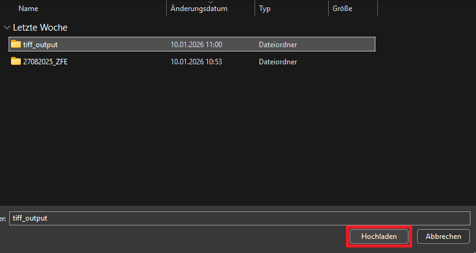

# 🐟 Zebrafish Segmentation Web App

## Table of Contents
- [How to use the Zebrafish Segmentation Web App](#How-to-use-the-Zebrafish-Segmentation-Web-App)
  - [Uploading Images](#uploading-images)
    - [Method 1: Upload a Folder (Preferred)](#method-1-upload-a-folder-preferred)
    - [Method 2: Upload Individual Images](#method-2-upload-individual-images)
  - [Selecting Endpoints](#selecting-endpoints)
  - [Results and Downloads](#results-and-downloads)

## How to use the Zebrafish Segmentation Web App

### Uploading Images

You can upload images of the zebrafish in two ways:

#### Method 1: Upload a Folder

You can upload an entire folder containing zebrafish images.

Select the folder of your choosing from the file dialog:

Then click "Upload" to upload the folder. You'll need to confirm the upload by clicking "Upload" again:

Wait for the images to load and appear:

#### Method 2: Upload Individual Images

Alternatively, you can upload individual images one by one.

Select the images of your choosing and click "Open" to upload them:

Wait for the images to load and appear:

### Selecting Endpoints

After uploading your images, choose which endpoints you want to analyze:

You can select:
- **Length**: Measure the length of the zebrafish (centerline path length in µm)
- **Curvature**: Classify the zebrafish into curvature classes (1-4)
  - Class 1: Most severe curvature
  - Class 2: Moderate-severe curvature
  - Class 3: Mild curvature
  - Class 4: Most healthy (minimal curvature)
- **Length/Straight Line Ratio**: The ratio between the actual centerline length and the straight-line distance between endpoints. A value close to 1.0 indicates a nearly straight fish, while higher values indicate more curvature. This metric quantifies body curvature independently of fish size.

You can also choose whether to enable **Threshold/Human-in-the-Loop mode** and set a threshold value. This mode allows for manual review of uncertain predictions (more details below).

**Threshold / Human-in-the-Loop (Curvature only)**

If you activate threshold mode you may set a confidence threshold between 0.0 and 1.0. The curvature classifier provides an inherent confidence score for its predicted curvature label; if the model's confidence for an image does not exceed the chosen threshold, that image will not be assigned a curvature class and will instead be reported as "Not Classified" in the Excel output. This thresholding applies only to curvature classification, length measurements are not affected.

Example: see . The left side shows the Excel output with threshold mode disabled (all images receive a curvature class). The right side shows threshold mode enabled with a threshold of 0.95: several images have confidence below 0.95 and are therefore marked "Not Classified", allowing those cases to be routed for manual review.

Use a higher threshold to reduce automatic curvature assignments and increase human review of uncertain cases; choose a lower threshold to classify more images automatically.

### Results and Downloads

After processing, you can download an Excel sheet containing individual fish annotations:

Below the download button, you'll see boxplots visualizing the distribution of the selected endpoints. These boxplots are also included in the Excel file:

The boxplots display:
- **Fish Lengths**: Distribution of measured centerline lengths in µm
- **Curvatures**: Distribution of curvature classifications (1-4)
- **Length/Straight Line Ratio**: Distribution of the length ratio metric, where values closer to 1.0 indicate straighter fish

The ratio visualization helps identify fish with significant body curvature. You can see in the example image that some fish have ratios above 1.0, indicating curved body shapes:

The cyan line shows the straight-line distance between endpoints, while the actual centerline path (shown in red) is longer due to body curvature. The ratio quantifies this difference.

#### Segmentation Preview

A gallery displays segmentation overlays for the uploaded images (thumbnails include a short filename label). You can interact with the gallery to mark images for exclusion before exporting a filtered results file — see the next section for details.

**Important:** Verify that the segmentations accurately match the fish. If the segmentations are incorrect or misaligned, the resulting endpoint measurements will be inaccurate. If you notice issues with the segmentations, you may need to adjust your images or use the threshold mode for manual review.

### Excluding segmentations & generating a filtered Excel

After the run you can exclude individual segmentation results and create a new Excel that omits those excluded images (the original Excel download remains unchanged).

- Click an image in the "Segmentations" gallery to toggle exclusion; excluded images are crossed out and annotated "(excluded)". As an alternative, use the checkbox row under the gallery to select images to exclude (labels are formatted `index:filename`).
- When you're ready, press the **Generate Filtered Excel** button (below the gallery). A separate download link `Download filtered results (.xlsx)` will appear containing only the non-excluded images.

See the UI examples:

The checkboxes under the gallery (or the gallery-click) let you mark images to exclude:

After generating, the filtered Excel file appears as a separate download and does not modify the original results file:

Use this workflow to remove bad segmentations or obvious outliers before downstream analysis.
